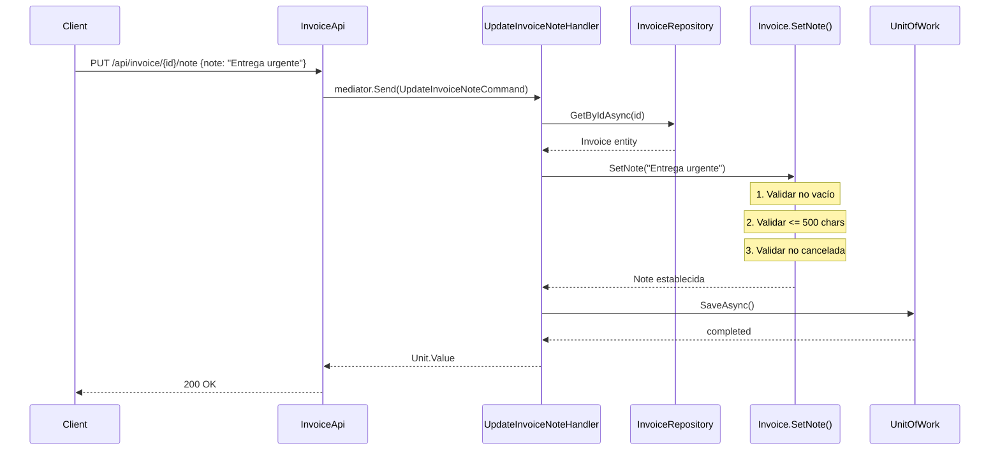
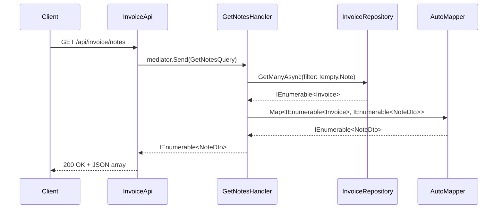

# Historia de Usuario — Agregar Notas a Facturas

> **Prioridad:** Media | **Complejidad:** Sencilla  
> **Capas involucradas:** Domain → Application → API → Infrastructure

---

## 1. Descripción (Formato User Story)

Como **cliente que consulta facturas**, quiero **agregar una nota/observación a una factura existente** para poder **documentar el motivo de la compra o alguna observación interna**.

### Criterios de Aceptación

| # | Criterio | Detalle |
|---|---|---|
| 1 | Endpoint de escritura | `PUT /api/invoice/{id}/note` acepta `{ "note": "texto" }` |
| 2 | Validación de nota | La nota no puede ser nula ni vacía, máximo 500 caracteres |
| 3 | Validación de existencia | Si la factura no existe, retorna 404 |
| 4 | Estado inmutable | Si la factura ya está cancelada, no se puede agregar nota (retorna 400) |
| 5 | Endpoint de lectura | `GET /api/invoice/{id}` retorna la nota en la respuesta |
| 6 | Query por nota | `GET /api/invoice/notes` retorna facturas que tienen nota no vacía |

---

## 2. Análisis de Impacto

### 2.1 Entidad a modificar

**`Invoice`** — Agregar campo `Note`

```csharp
public string? Note { get; private set; }
```

- Campo nullable (la nota es opcional)
- Setter privado (solo la entidad modifica su propia nota)
- Se actualiza vía método `SetNote(string note)` que aplica validaciones

### 2.2 Cambios por capa

| Capa | Archivos a crear/modificar |
|---|---|
| **Domain** | `Invoice.cs` — agregar propiedad `Note` y método `SetNote()` |
| **Application** | `UpdateInvoiceNoteCommand.cs`, `UpdateInvoiceNoteHandler.cs`, `GetNotesQuery.cs`, `GetNotesHandler.cs` |
| **Application DTO** | `NoteDto.cs` |
| **API** | `InvoiceApi.cs` — agregar 2 nuevos endpoints |
| **API Filters** | `UpdateInvoiceNoteCommandValidator.cs` — validación de nota |
| **Infrastructure** | `InvoiceRepository.cs` — sin cambios (EF Core mapea auto) |
| **Infrastructure** | `InvoiceSimpleQueryRepository.cs` — agregar query para notas |

---

## 3. Diseño Detallado

### 3.1 Dominio — Entidad `Invoice`

**Agregar a `FooBar.Domain/Invoices/Model/Entity/Invoice.cs`:**

```csharp
public string? Note { get; private set; }

const int MinNoteLength = 1;
const int MaxNoteLength = 500;

public void SetNote(string note)
{
    note.ValidateRequired("the note should not be null or empty.");
    note.ValidateLength(MinNoteLength, MaxNoteLength, 
        $"the note should be between {MinNoteLength} and {MaxNoteLength} characters.");
    
    if (State == InvoiceState.Canceled)
    {
        throw new CoreBusinessException("cannot add a note to a canceled invoice.");
    }
    
    Note = note.Trim();
}
```

**Conceptos .NET que practicas:**
- `string?` = nullable reference type (C# 8+)
- `private set` = inmutable por defecto, solo la entidad controla cambios
- `Trim()` = limpiar espacios en blanco
- Validaciones en el setter del dominio (no en el DTO)

### 3.2 Aplicación — Command

**Crear `FooBar.Application/Invoices/Command/UpdateInvoiceNoteCommand.cs`:**

```csharp
using MediatR;

namespace FooBar.Application.Invoice.Command
{
    public record UpdateInvoiceNoteCommand(Guid Id, string Note) : IRequest<Unit>;
}
```

**Crear `FooBar.Application/Invoices/Command/UpdateInvoiceNoteHandler.cs`:**

```csharp
using FooBar.Application.Ports;
using FooBar.Domain.Invoices.Port;
using MediatR;

namespace FooBar.Application.Invoice.Command
{
    internal class UpdateInvoiceNoteHandler(
        IInvoiceRepository invoiceRepository, 
        IUnitOfWork unitOfWork) : IRequestHandler<UpdateInvoiceNoteCommand, Unit>
    {
        public async Task<Unit> Handle(UpdateInvoiceNoteCommand request, CancellationToken cancellationToken)
        {
            var invoice = await invoiceRepository.GetByIdAsync(request.Id);
            invoice.ValidateNull("the invoice does not exist.");
            
            invoice.SetNote(request.Note);
            
            await unitOfWork.SaveAsync();
            return Unit.Value;
        }
    }
}
```

**Conceptos .NET que practicas:**
- `record` = tipo inmutable con value semantics (diferente de Java class)
- `IRequestHandler<TCommand, TResponse>` = patrón MediatR
- `Unit` = tipo sin valor (equivalente a `void` pero como tipo)
- Constructor inyección con `()` = primary constructor de C# 12

### 3.3 Aplicación — Query

**Crear `FooBar.Application/Invoices/Query/GetNotesQuery.cs`:**

```csharp
using FooBar.Application.Invoice.Query.Dto;
using MediatR;

namespace FooBar.Application.Invoice.Query
{
    public record GetNotesQuery() : IRequest<IEnumerable<NoteDto>>;
}
```

**Crear `FooBar.Application/Invoices/Query/GetNotesHandler.cs`:**

```csharp
using FooBar.Application.Invoice.Query.Dto;
using FooBar.Domain.Invoices.Port;
using MediatR;

namespace FooBar.Application.Invoice.Query
{
    internal class GetNotesHandler(IInvoiceRepository invoiceRepository, IMapper mapper) 
        : IRequestHandler<GetNotesQuery, IEnumerable<NoteDto>>
    {
        public async Task<IEnumerable<NoteDto>> Handle(GetNotesQuery request, CancellationToken cancellationToken)
        {
            var invoices = await invoiceRepository.GetManyAsync(
                filter: i => !string.IsNullOrEmpty(i.Note)
            );
            
            return mapper.Map<IEnumerable<NoteDto>>(invoices);
        }
    }
}
```

> **Nota:** Si `IRepository<T>` no tiene `GetManyAsync` con filtro, se puede hacer vía `DataContext` directo o agregar el método.

### 3.4 DTOs

**Crear `FooBar.Application/Invoices/Query/Dto/NoteDto.cs`:**

```csharp
namespace FooBar.Application.Invoice.Query.Dto
{
    public record NoteDto
    {
        public Guid Id { get; set; }
        public string? Note { get; set; }
        public decimal ValueTotal { get; set; }
        public string State { get; set; } = default!;
    }
}
```

**Actualizar `FooBar.Application/Invoices/Query/Dto/InvoiceDto.cs`** — agregar:

```csharp
public string? Note { get; set; }
```

**Actualizar `FooBar.Application/Invoices/InvoiceProfile.cs` (AutoMapper)** — agregar mapeo:

```csharp
CreateMap<Domain.Invoices.Model.Entity.Invoice, InvoiceDto>()
    .ForMember(dest => dest.Note, opt => opt.MapFrom(src => src.Note));
```

### 3.5 API — Endpoints

**Agregar a `FooBar.Api/ApiHandlers/InvoiceApi.cs`:**

```csharp
// PUT /api/invoice/{id}/note — agregar/modificar nota
routeHandler.MapPut("/{id}/note", async (IMediator mediator, Guid id, [Validate] UpdateInvoiceNoteCommand command) =>
{
    await mediator.Send(command);
    return Results.Ok();
})
.Produces(StatusCodes.Status200OK)
.Produces(StatusCodes.Status404NotFound)
.Produces(StatusCodes.Status400BadRequest)
.WithSummary("Add or update note on an invoice")
.WithOpenApi();


// GET /api/invoice/notes — obtener facturas con nota
routeHandler.MapGet("/notes", async (IMediator mediator, HttpResponse response) =>
{
    var result = await mediator.Send(new GetNotesQuery());
    var json = System.Text.Json.JsonSerializer.Serialize(result);
    response.ContentType = "application/json";
    await response.WriteAsync(json);
})
.Produces(StatusCodes.Status200OK)
.WithSummary("Get invoices that have notes")
.WithOpenApi();
```

### 3.6 Validación

**Crear `FooBar.Api/Filters/UpdateInvoiceNoteCommandValidator.cs`:**

```csharp
using FooBar.Application.Invoice.Command;
using FluentValidation;

namespace FooBar.Api.Filters
{
    public class UpdateInvoiceNoteCommandValidator : AbstractValidator<UpdateInvoiceNoteCommand>
    {
        public UpdateInvoiceNoteCommandValidator()
        {
            RuleFor(x => x.Id).NotEmpty().WithMessage("the invoice id is required.");
            RuleFor(x => x.Note).NotEmpty().WithMessage("the note cannot be empty.")
                                .MaximumLength(500).WithMessage("the note cannot exceed 500 characters.");
        }
    }
}
```

### 3.7 Infraestructura — Query Repository

**Agregar a `FooBar.Infrastructure/Invoices/Adapters/InvoiceSimpleQueryRepository.cs`:**

```csharp
public async Task<IEnumerable<NoteDto>> GetAllWithNotesAsync()
{
    var notes = await DbConnection
        .QueryAsync<NoteDto>(@"select id, ValueTotal, State, Note from Invoice where Note is not null and Note != ''");
    return notes;
}
```

**Agregar puerto correspondiente en `IInvoiceSimpleQueryRepository.cs`:**

```csharp
Task<IEnumerable<NoteDto>> GetAllWithNotesAsync();
```

---

## 4. Diagrama de Flujo

### Flujo de Agregar Nota



### Flujo de Consulta de Notas



---

## 5. Checklist de Implementación

### Fase 1 — Dominio
- [ ] Agregar propiedad `Note` a `Invoice.cs`
- [ ] Agregar método `SetNote(string note)` con validaciones
- [ ] Ejecutar: `dotnet test FooBar.Domain.Tests`

### Fase 2 — Aplicación
- [ ] Crear `UpdateInvoiceNoteCommand.cs`
- [ ] Crear `UpdateInvoiceNoteHandler.cs`
- [ ] Crear `GetNotesQuery.cs`
- [ ] Crear `GetNotesHandler.cs`
- [ ] Crear `NoteDto.cs`
- [ ] Actualizar `InvoiceDto.cs` con campo `Note`
- [ ] Actualizar `InvoiceProfile.cs` (AutoMapper)
- [ ] Ejecutar: `dotnet test FooBar.Application`

### Fase 3 — API
- [ ] Crear `UpdateInvoiceNoteCommandValidator.cs`
- [ ] Agregar endpoint `PUT /api/invoice/{id}/note`
- [ ] Agregar endpoint `GET /api/invoice/notes`
- [ ] Ejecutar: `dotnet test FooBar.Api.Tests`

### Fase 4 — Infraestructura
- [ ] Agregar método a `IInvoiceSimpleQueryRepository`
- [ ] Implementar en `InvoiceSimpleQueryRepository`
- [ ] Verificar que EF Core mapea la columna `Note` automáticamente
- [ ] Ejecutar: `dotnet ef migrations add AddInvoiceNote`
- [ ] Ejecutar: `dotnet ef database update`

### Fase 5 — Pruebas
- [ ] Probar creación de nota con POST/PUT
- [ ] Probar validación de nota vacía (400)
- [ ] Probar nota > 500 chars (400)
- [ ] Probar nota en factura cancelada (400)
- [ ] Probar factura no existente (404)
- [ ] Probar consulta de notas (GET /notes)
- [ ] Verificar Swagger UI muestra nuevos endpoints

---

## 6. Conceptos .NET para Practicar

| Concepto | Dónde se aplica |
|---|---|
| **Nullable Reference Types** (`string?`) | Propiedad `Note` en entidad y DTOs |
| **Primary Constructors** | Handlers con `class Handler(Dependency dep)` |
| **Records** | Commands, Queries, DTOs como `record` |
| **IRequestHandler\<T, TResponse\>** | Patrón MediatR CQRS |
| **Unit** | Tipo sin valor para Commands que no retornan datos |
| **FluentValidation** | `AbstractValidator<T>` con `RuleFor()` |
| **AutoMapper** | Mapeo Entity → DTO con `.ForMember()` |
| **Minimal APIs** | `.MapPut()`, `.MapGet()` con `RouteGroupBuilder` |
| **EF Core Shadow Properties** | `Id` se mapea auto (ya configurado) |
| **CancellationToken** | Propagación en toda la cadena de handlers |

---

## 7. Preguntas de Reflexión

1. **¿Por qué `Note` es `string?` y no `string`?**  
   → Porque es opcional. En .NET, `string?` habilita warnings del compilador si se usa sin null-check.

2. **¿Por qué el setter de `Note` es `private set`?**  
   → Inmutabilidad controlada. Solo la entidad decide cuándo y cómo cambia su estado (patrón Active Record).

3. **¿Qué diferencia hay entre `record` y `class` en C#?**  
   → `record` es inmutable por defecto, tiene value semantics (comparación por contenido, no referencia), y soporta `with` expression para copias inmutables.

4. **¿Por qué `Unit` en vez de `void` en el handler?**  
   → MediatR necesita un tipo genérico. `Unit` es el equivalente a "sin valor" pero como tipo, permitiendo composibilidad.

5. **¿Por qué separar Command (escritura) de Query (lectura)?**  
   → CQRS: separa responsabilidades. Commands modifican estado (usa EF Core), Queries solo leen (puede usar Dapper).

---

**Documento creado:** 2026-07-29  
**Método Ceiba — Historia de Usuario para Estudio**