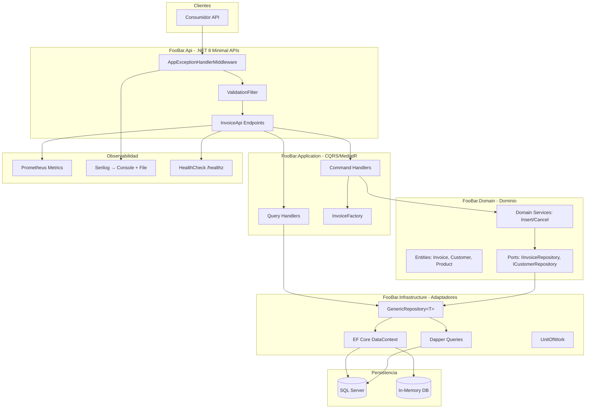

# Arquitectura del Sistema - GPS Principal

Este documento sirve como **GPS arquitectónico** para orientar decisiones de diseño y desarrollo en el ecosistema.

## Resumen Ejecutivo

### Propósito y alcance del sistema

FooBar es un microservicio REST para gestión de facturas, construido como plantilla Ceiba Block (.NET 8) con arquitectura Domain-Centric (Hexagonal/Clean/Onion). Expone endpoints CRUD para crear, consultar y cancelar facturas, aplicando CQRS para separar lecturas y escrituras.

**Alcance:** Gestión de facturas (crear, cancelar, consultar), modelos de Cliente, Producto y TipoCliente.
**Fuera de alcance:** Gestión de usuarios, pasarelas de pago, notificaciones externas.

### Dominios y repositorios críticos

- **Dominios críticos**: Facturas (core), Clientes, Productos
- **Repositorios críticos**: `DataContext` (EF Core), `InvoiceRepository`, `InvoiceSimpleQueryRepository` (Dapper)
- **Límites**: Sistema autocontenido; no consume servicios externos en su versión actual

## Arquitectura de Alto Nivel

### Diagrama principal del ecosistema

## Stack y Patrones Clave

### Tecnologías que condicionan arquitectura

- **.NET 8.0** con Minimal APIs, top-level statements, global usings, records
- **MediatR 12** — CQRS automático con registro por reflexión (MediaTR)
- **EF Core 8** — Escrituras (Command side), Code First, migraciones
- **Dapper 2** — Lecturas optimizadas (Query side), consultas SQL directas
- **FluentValidation 11** — Validación declarativa en Commands
- **AutoMapper 13** — Mapeo Entity → DTO
- **Serilog 8** — Logging estructurado (consola + archivo)
- **Prometheus 8** — Métricas expuestas vía `/metrics`
- **Docker** — Contenerización con multi-stage build (SDK 7.0 runtime)
- **xUnit + NSubstitute** — Pruebas unitarias e integración

### Patrones arquitectónicos relevantes

- **Puertos y Adaptadores (Hexagonal)**: Dominio aislado de tecnologías; repositorios como puertos, Infrastructure como adaptadores
- **CQRS**: Commands (EF Core) y Queries (Dapper) separados; handlers en Application, dominio en Domain
- **Repository Genérico + Especializado**: `IRepository<T>` base con operaciones CRUD; repositorios específicos (InvoiceRepository) con lógica de dominio
- **Domain Services con inyección automática**: Atributo `[DomainService]` escanea assemblies y registra servicios
- **Factory Pattern**: `InvoiceFactory` orquesta creación de agregados con validación de existencia
- **Shadow Properties**: `CreatedOn`/`LastModifiedOn` inyectados automáticamente en `DomainEntity`
- **Exception Handler Global**: Middleware centraliza manejo de excepciones con mapeo a HTTP status codes

## Integraciones Críticas

### Integraciones internas y externas de mayor impacto

| Integración | Propósito | Canal | Criticidad |
|---|---|---|---|
| SQL Server | Persistencia de dominio | EF Core / Dapper (ADO.NET) | Alta |
| Prometheus | Métricas y monitoreo | HTTP `/metrics` | Media |
| HealthCheck | Monitoreo de salud | HTTP `/healthz` | Alta |
| Serilog | Logging persistente | Archivo disco + consola | Media |

### Seguridad de integración (Auth/Authz)

- **Autenticación**: JWT Bearer (`Microsoft.AspNetCore.Authentication.JwtBearer`) — configurado pero no activado en endpoints demo
- **Autorización**: No implementada en versión actual (sin `[Authorize]` en endpoints)
- **Controles críticos**: `AppExceptionHandlerMiddleware` mapea excepciones de dominio a HTTP status codes; `ValidationFilter` valida inputs con FluentValidation

## Dependencias Externas Estratégicas

### Servicios y terceros que condicionan la solución

| Dependencia | Rol Arquitectónico | Impacto si falla/cambia |
|---|---|---|
| SQL Server | Motor de persistencia principal | Bloqueante — servicio cae |
| EF Core / Dapper | ORM y micro-ORM | Medio — requiere ajustes en adaptadores |
| Prometheus-net | Exportador de métricas | Bajo — observabilidad degradada |
| Serilog | Framework de logging | Bajo — sin trazabilidad |

## Referencias Base

### Documentación analizada y fuentes clave

- `README.md` — Descripción de plantillas Ceiba Block (Puertos/Adaptadores, CQRS, HealthCheck, especificaciones técnicas)
- `azure-pipelines.yml` — Pipeline CI/CD (SonarQube, Stryker, pruebas, contenedores)
- `FooBar.Architecture.Tests/PruebasDeArquitectura.cs` — Reglas ArchUnitNET (independencia de capas)
- `FooBar.Api/Program.cs` — Configuración de la aplicación y registro de servicios
- `FooBar.Domain/` — Código fuente real de entidades, puertos y servicios de dominio

---

**Este GPS es una vista arquitectónica ejecutiva para orientar decisiones y priorizar evolución del sistema.**

---

> **Método Ceiba documentar-arquitectura-base** | Usuario: Claudia | Fecha: 2026-07-23