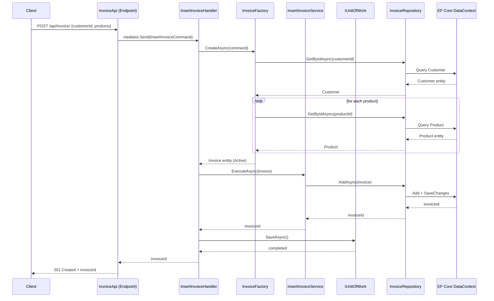
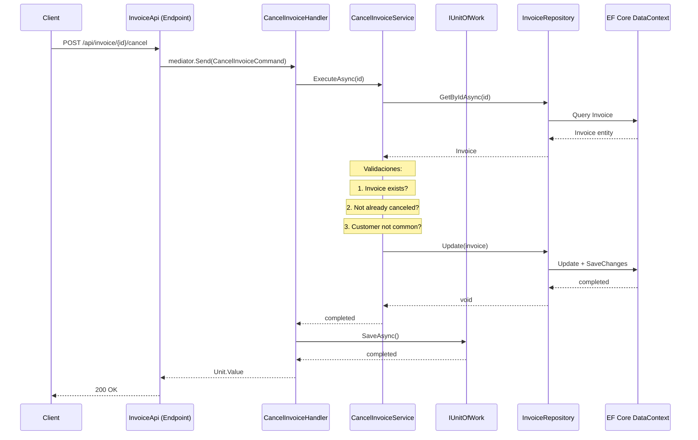
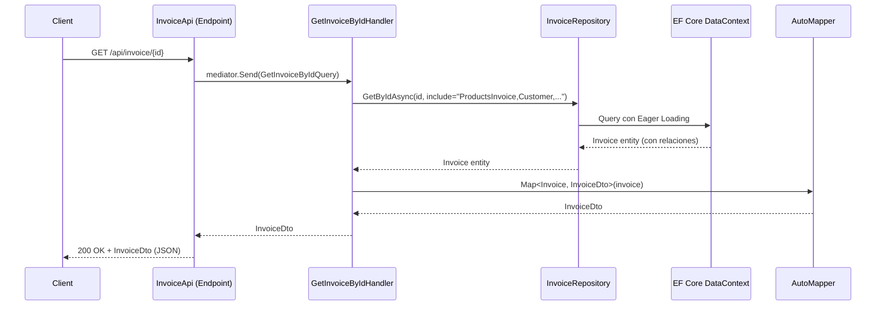

# Servicios del Sistema FooBar

Este documento documenta todos los servicios del sistema, organizados por capa arquitectónica.

---

## Tabla de Contenidos

1. [Capa de Dominio — Domain Services](#capa-de-dominio--domain-services)
2. [Capa de Aplicación — Application Handlers & Factory](#capa-de-aplicación--application-handlers--factory)
3. [Capa de Infraestructura — Repository Adapters](#capa-de-infraestructura--repository-adapters)
4. [Capa de API — Middleware & Filters](#capa-de-api--middleware--filters)
5. [Extensión de Registro de Servicios](#extensión-de-registro-de-servicios)
6. [Diagrama de Flujo de Servicio](#diagrama-de-flujo-de-servicio)

---

## Capa de Dominio — Domain Services

### `InsertInvoiceService`

| Propiedad | Detalle |
|---|---|
| **Ubicación** | `FooBar.Domain/Invoices/Service/InsertInvoiceService.cs` |
| **Patrón** | Domain Service con atributo `[DomainService]` |
| **Interfaz** | `InsertInvoiceService(IInvoiceRepository invoiceRepository)` |
| **Método principal** | `Task<Guid> ExecuteAsync(Invoice invoice)` |

**Responsabilidad:** Persistir una factura en el sistema a través del repositorio de dominio.

**Comportamiento:**
1. Recibe una entidad `Invoice` completamente construida (validada y con estado)
2. Delega la persistencia a `IInvoiceRepository.AddAsync(invoice)`
3. Retorna el `Guid` de la factura creada

**Dependencias:**
- `IInvoiceRepository` — Puerto de repositorio de facturas

**Notas de diseño:**
- Servicio mínimo intencionalmente — la lógica de negocio está en la entidad y el factory
- El atributo `[DomainService]` permite escaneo por reflexión y registro automático en DI

---

### `CancelInvoiceService`

| Propiedad | Detalle |
|---|---|
| **Ubicación** | `FooBar.Domain/Invoices/Service/CancelInvoiceService.cs` |
| **Patrón** | Domain Service con atributo `[DomainService]` |
| **Interfaz** | `CancelInvoiceService(IInvoiceRepository invoiceRepository)` |
| **Método principal** | `Task ExecuteAsync(Guid id)` |

**Responsabilidad:** Cancelar una factura existente validando las reglas de negocio.

**Comportamiento:**
1. Busca la factura por ID usando `IInvoiceRepository.GetByIdAsync(id)`
2. Valida que la factura exista (`ValidateNull`)
3. Valida que no esté ya cancelada (`invoice.IsCancel()` — lanza excepción si lo está)
4. Valida que el cliente no sea "común" (`invoice.IsCancel()` — la entidad verifica `Customer.IsCommon()`)
5. Cambia el estado a `Canceled` (`invoice.Cancel()`)
6. Persiste el cambio vía `invoiceRepository.Update(invoice)`

**Dependencias:**
- `IInvoiceRepository` — Puerto de repositorio de facturas

**Reglas de negocio encapsuladas:**
- Una factura no se puede cancelar si ya está cancelada
- Una factura de cliente común no se puede cancelar (regla de dominio)
- Solo facturas de clientes preferenciales o especiales pueden cancelarse

---

## Capa de Aplicación — Application Handlers & Factory

### `InsertInvoiceHandler`

| Propiedad | Detalle |
|---|---|
| **Ubicación** | `FooBar.Application/Invoices/Command/InsertInvoiceHandler.cs` |
| **Patrón** | Command Handler (CQRS / MediatR) |
| **Interfaz** | `IRequestHandler<InsertInvoiceCommand, Guid>` |
| **Constructor** | `InsertInvoiceHandler(InvoiceFactory, InsertInvoiceService, IUnitOfWork)` |

**Responsabilidad:** Orquestar el flujo de creación de una factura.

**Flujo de ejecución:**
1. Recibe `InsertInvoiceCommand` (CustomerId + Productos)
2. Invoca `InvoiceFactory.CreateAsync(command)` — construye la entidad `Invoice` con validación de existencia de cliente y productos
3. Invoca `InsertInvoiceService.ExecuteAsync(invoice)` — persiste la entidad
4. Llama `unitOfWork.SaveAsync()` — confirma la transacción
5. Retorna el `Guid` de la factura creada

**Dependencias:**
- `InvoiceFactory` — Factory para construir la entidad con validaciones de existencia
- `InsertInvoiceService` — Domain service para persistencia
- `IUnitOfWork` — Unidad de trabajo para commit de transacción

---

### `CancelInvoiceHandler`

| Propiedad | Detalle |
|---|---|
| **Ubicación** | `FooBar.Application/Invoices/Command/CancelInvoiceHandler.cs` |
| **Patrón** | Command Handler (CQRS / MediatR) |
| **Interfaz** | `IRequestHandler<CancelInvoiceCommand, Unit>` |
| **Constructor** | `CancelInvoiceHandler(CancelInvoiceService, IUnitOfWork)` |

**Responsabilidad:** Orquestar el flujo de cancelación de una factura.

**Flujo de ejecución:**
1. Recibe `CancelInvoiceCommand` con el ID de la factura
2. Invoca `CancelInvoiceService.ExecuteAsync(id)` — aplica reglas de negocio de cancelación
3. Llama `unitOfWork.SaveAsync()` — confirma la transacción
4. Retorna `Unit.Value` (comando sin retorno de datos)

**Dependencias:**
- `CancelInvoiceService` — Domain service con reglas de cancelación
- `IUnitOfWork` — Unidad de trabajo para commit de transacción

---

### `GetInvoiceByIdHandler`

| Propiedad | Detalle |
|---|---|
| **Ubicación** | `FooBar.Application/Invoices/Query/GetInvoiceByIdHandler.cs` |
| **Patrón** | Query Handler (CQRS / MediatR) |
| **Interfaz** | `IRequestHandler<GetInvoiceByIdQuery, InvoiceDto>` |
| **Constructor** | `GetInvoiceByIdHandler(IInvoiceRepository, IMapper)` |

**Responsabilidad:** Consultar una factura por ID y mapearla a DTO.

**Flujo de ejecución:**
1. Recibe `GetInvoiceByIdQuery` con el ID
2. Construye cadena de `include` para Eager Loading: `ProductsInvoice, Customer, ProductsInvoice.Product`
3. Consulta la factura vía `IInvoiceRepository.GetByIdAsync(id, includeString)`
4. Mapea la entidad `Invoice` a `InvoiceDto` usando AutoMapper
5. Retorna el DTO

**Dependencias:**
- `IInvoiceRepository` — Puerto de consulta/escritura de facturas
- `IMapper` — AutoMapper para Entity → DTO

**DTO retornado:** `InvoiceDto` (Id, ValueTotal, State, Customer, ProductsInvoice)

---

### `GetAllCancelHandler`

| Propiedad | Detalle |
|---|---|
| **Ubicación** | `FooBar.Application/Invoices/Query/GetAllCancelHandler.cs` |
| **Patrón** | Query Handler (CQRS / MediatR) |
| **Interfaz** | `IRequestHandler<GetAllCancelQuery, IEnumerable<SummaryInvoiceDto>>` |
| **Constructor** | `GetAllCancelHandler(IInvoiceSimpleQueryRepository)` |

**Responsabilidad:** Consultar todas las facturas canceladas.

**Flujo de ejecución:**
1. Recibe `GetAllCancelQuery` (sin parámetros)
2. Delega a `IInvoiceSimpleQueryRepository.GetAllCancelAsync()`
3. Retorna `IEnumerable<SummaryInvoiceDto>`

**Dependencias:**
- `IInvoiceSimpleQueryRepository` — Repositorio de consultas optimizado con Dapper

**DTO retornado:** `SummaryInvoiceDto` (Id, ValueTotal, State) — vista ligera sin relaciones

---

### `InvoiceFactory`

| Propiedad | Detalle |
|---|---|
| **Ubicación** | `FooBar.Application/Invoices/Command/Factory/InvoiceFactory.cs` |
| **Patrón** | Factory (Creación de agregados) |
| **Constructor** | `InvoiceFactory(ICustomerRepository, IProductRepository)` |

**Responsabilidad:** Construir una entidad `Invoice` validando la existencia de sus dependencias (Cliente y Productos).

**Flujo de ejecución:**
1. Recibe `InsertInvoiceCommand` (CustomerId + IEnumerable<ProductInvoiceCommand>)
2. Valida existencia del cliente: `customerRepository.GetByIdAsync(customerId)` — lanza si no existe
3. Itera sobre los productos del comando:
   - Valida existencia de cada producto: `productRepository.GetByIdAsync(productId)` — lanza si no existe
   - Construye `ProductInvoice` para cada producto válido
4. Construye la entidad `Invoice` con:
   - `Customer` = cliente validado
   - `ProductsInvoice` = colección de ProductInvoices
   - `State` = `InvoiceState.Active`
5. Retorna la entidad `Invoice` lista para persistir

**Dependencias:**
- `ICustomerRepository` — Puerto de consulta de clientes
- `IProductRepository` — Puerto de consulta de productos

**Validaciones de existencia:**
- Cliente debe existir → lanza excepción con mensaje `the customer with id {id} does not exist.`
- Cada producto debe existir → lanza excepción con mensaje `the product with id {id} does not exist.`

---

## Capa de Infraestructura — Repository Adapters

### `InvoiceRepository`

| Propiedad | Detalle |
|---|---|
| **Ubicación** | `FooBar.Infrastructure/Invoices/Adapters/InvoiceRepository.cs` |
| **Patrón** | Adaptador de Puerto (Hexagonal) — Escritura |
| **Interfaz implementada** | `IInvoiceRepository` |
| **Atributo** | `[Repository]` — registro automático en DI |
| **Constructor** | `InvoiceRepository(IRepository<Invoice>)` |

**Responsabilidad:** Implementar el puerto `IInvoiceRepository` usando EF Core a través del repositorio genérico.

**Métodos implementados:**

| Método | Implementación |
|---|---|
| `AddAsync(Invoice)` | Delega a `invoiceRepository.AddAsync(invoice)` y retorna `invoiceInsert.Id` |
| `GetByIdAsync(Guid)` | Delega a `invoiceRepository.GetOneAsync(id)` |
| `GetByIdAsync(Guid, string?)` | Delega a `invoiceRepository.GetOneAsync(id, include)` — soporta Eager Loading |
| `Update(Invoice)` | Delega a `invoiceRepository.UpdateAsync(invoice)` |

**Dependencias:**
- `IRepository<Invoice>` — Repositorio genérico que usa EF Core `DataContext`

**Tecnología subyacente:** Entity Framework Core (Code First)

---

### `InvoiceSimpleQueryRepository`

| Propiedad | Detalle |
|---|---|
| **Ubicación** | `FooBar.Infrastructure/Invoices/Adapters/InvoiceSimpleQueryRepository.cs` |
| **Patrón** | Adaptador de Puerto (Hexagonal) — Lectura optimizada |
| **Interfaz implementada** | `IInvoiceSimpleQueryRepository` |
| **Atributo** | `[Repository]` — registro automático en DI |
| **Constructor** | `InvoiceSimpleQueryRepository(DataContext)` |

**Responsabilidad:** Consultar facturas canceladas usando Dapper para rendimiento.

**Método implementado:**

| Método | Implementación |
|---|---|
| `GetAllCancelAsync()` | Ejecuta SQL directo: `SELECT id, ValueTotal, State FROM Invoice WHERE State = @State` con Dapper |

**Tecnología subyacente:** Dapper (micro-ORM) + ADO.NET `IDbConnection`

**SQL ejecutado:**
```sql
SELECT id, ValueTotal, State 
FROM Invoice 
WHERE State = @State
```
Parámetro: `State = InvoiceState.Canceled`

**DTO retornado:** `SummaryInvoiceDto` — vista plana sin joins ni relaciones

**Ventaja de diseño:** Separa lecturas simples (Dapper, rápido) de escrituras (EF Core, ORM completo)

---

## Capa de API — Middleware & Filters

### `AppExceptionHandlerMiddleware`

| Propiedad | Detalle |
|---|---|
| **Ubicación** | `FooBar.Api/Middleware/AppExceptionHandlerMiddleware.cs` |
| **Patrón** | Middleware de ASP.NET Core |
| **Registro** | `app.UseMiddleware<AppExceptionHandlerMiddleware>()` en `Program.cs` |

**Responsabilidad:** Capturar excepciones no manejadas y mapearlas a respuestas HTTP apropiadas.

**Comportamiento:**
- Intercepta excepciones en la pipeline de request
- Mapea excepciones de dominio a HTTP status codes (400, 404, 500, etc.)
- Retorna respuesta JSON con detalle del error
- Evita que excepciones de dominio expongan stack traces al cliente

**Orden de ejecución:** Se registra antes de `UseRouting` y `UseEndpoints`

---

### `ValidationFilter`

| Propiedad | Detalle |
|---|---|
| **Ubicación** | `FooBar.Api/Filters/ValidationFilter.cs` |
| **Patrón** | Endpoint Filter de ASP.NET Core |
| **Atributo** | `[Validate]` — marca parámetros para validación automática |
| **Registro** | `builder.Services.AddValidatorsFromAssemblyContaining<Program>(ServiceLifetime.Singleton)` |

**Responsabilidad:** Validar los inputs de los endpoints usando FluentValidation.

**Comportamiento:**
- Se aplica a handlers marcados con `[Validate]`
- Busca el `IValidator<T>` correspondiente al tipo del parámetro
- Si la validación falla, retorna 400 Bad Request con detalles
- Si pasa, continúa al handler

**Validadores registrados:**
- `InsertInvoiceCommandValidator` — valida `InsertInvoiceCommand`
- `ProductInvoiceCommandValidator` — valida `ProductInvoiceCommand`

---

## Extensión de Registro de Servicios

### `AddServices()`

| Propiedad | Detalle |
|---|---|
| **Ubicación** | `FooBar.Infrastructure/Extensions/AddServices.cs` (namespace `FooBar.Infrastructure.Extensions`) |
| **Patrón** | Extension method para registro en DI |
| **Llamada** | `builder.Services.AddServices()` en `Program.cs` |

**Responsabilidad:** Registrar automáticamente todos los servicios de dominio e infraestructura.

**Servicios registrados:**
1. **Domain Services** — Escanea assemblies buscando clases con atributo `[DomainService]` y las registra en DI
2. **Repository Adapters** — Escanea assemblies buscando clases con atributo `[Repository]` y las registra en DI

**Tecnología:** Reflexión + registro por patrón (convention-based registration)

---

## Diagrama de Flujo de Servicio

### Flujo de Creación de Factura



### Flujo de Cancelación de Factura



### Flujo de Consulta de Factura



---

## Resumen de Responsabilidades por Capa

| Capa | Servicios | Responsabilidad Principal |
|---|---|---|
| **Domain** | `InsertInvoiceService`, `CancelInvoiceService` | Reglas de negocio, invariantes de dominio |
| **Application** | `InsertInvoiceHandler`, `CancelInvoiceHandler`, `GetInvoiceByIdHandler`, `GetAllCancelHandler`, `InvoiceFactory` | Orquestación de flujos, CQRS, creación de agregados |
| **Infrastructure** | `InvoiceRepository`, `InvoiceSimpleQueryRepository` | Adaptación a tecnologías de persistencia (EF Core, Dapper) |
| **API** | `AppExceptionHandlerMiddleware`, `ValidationFilter` | Cross-cutting concerns (validación, manejo de errores) |

---

**Documento generado:** 2026-07-29  
**Método Ceiba — Documentación de Servicios**